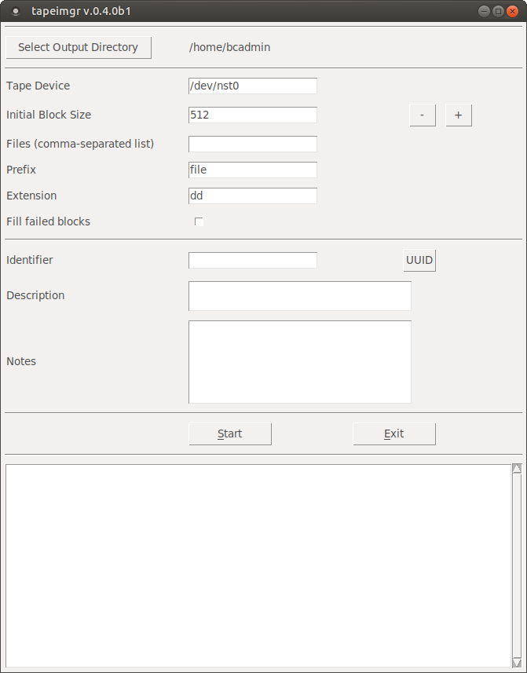
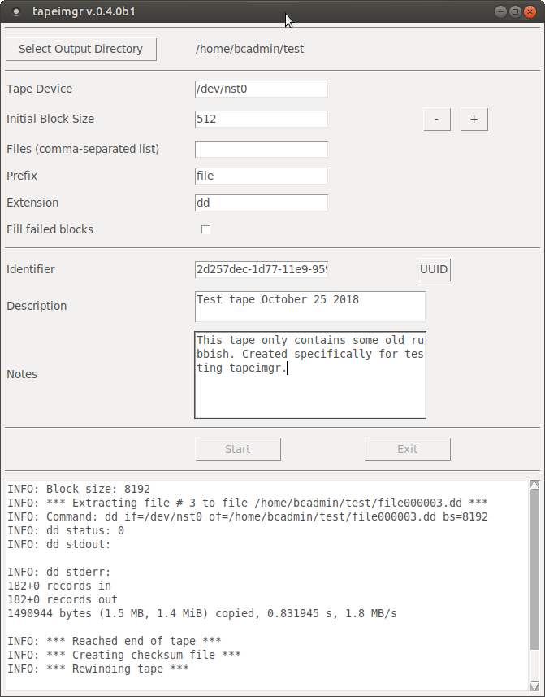

# tapeimgr

**Tapeimgr** is a software application that sequentially reads all files from a data tape. After the extraction is done it also generates a checksum file with SHA-512 hashes of the extracted files. *Tapeimgr* is completely format-agnostic, and it is the user's responsibility to figure out how to further process or open the extracted files.

In short, *tapeimgr* tries to read sequential files from a tape until its logical end is reached. For each successive file, it automatically determines its block size using an iterative procedure.

Internally *tapeimgr* wraps around the Linux [*dd*](http://manpages.ubuntu.com/manpages/bionic/man1/dd.1.html) and [*mt*](http://manpages.ubuntu.com/manpages/bionic/man1/mt.1.html) tools. 

## Warning

At this stage *tapeimgr* has only had limited testing with a small number of DDS-1 and DLT-IV tapes. Use at your own risk, and please report any unexpected behaviour using the issue tracker.

## System requirements

- **OS: Linux-only** (but you would probably have a hard time setting up a tape drive on Windows to begin with). Tested with Ubuntu 18.04 LTS (Bionic) and Linux Mint 18.3, which is based on Ubuntu 16.04 (Xenial).

- **Python 3.2 or more recent** (Python 2.x is not supported)

- **Tkinter**. If *tkinter* is not installed already, you need to use the OS's package manager to install (there is no PyInstaller package for *tkinter*). If you're using *apt* this should work:

    sudo apt-get install python3-tk

- **dd** and **mt** (but these are available by default on all Linux platforms) activated

## Installation

First install *tapeimgr* with the following command (note that user installs currently don' t work!):

    sudo pip3 install tapeimgr

Then run:

    sudo tapeimgr-config

If all goes well this should result in the following output:

    INFO: writing configuration file /etc/tapeimgr/tapeimgr.json
    INFO: creating pkexec launcher /usr/local/bin/tapeimgr-pkexec
    INFO: creating policy file /usr/share/polkit-1/actions/com.ubuntu.pkexec.tapeimgr.policy
    INFO: creating desktop file /home/bcadmin/Desktop/tapeimgr.desktop
    INFO: creating desktop file /usr/share/applications/tapeimgr.desktop
    INFO: tapeimgr configuration completed successfully!

*Tapeimgr* is now ready to roll!

In the instructions that follow below, it is assumed that you have a functioning tape device attached to your machine, and that a tape is loaded (i.e. inserted in the drive).

## GUI operation

You can start *tapeimgr* from the OS's main menu (in Ubuntu 18.04 the *tapeimgr* item is located under *System Tools*), or by clicking the *tapeimgr* shortcut on the desktop. Depending on your distro, you might get an "Untrusted application launcher" warning the first time you activate the shortcut. You can get rid of this by clicking on "Mark as Trusted". As *tapeimgr* is launched as root (this is needed to access the tape device), you will get a prompt that asks for your password:

After authenticating the main *tapeimgr* window appears:

Use the *Select Output Directory* button to navigate to an (empty) directory where the extracted files are to be stored. Press the *Start* button to start the extraction. You can monitor the progress of the extraction procedure in the progress window:

Note that the screen output is also written to a log file in the output directory. A prompt appears when the extraction is finished:

If the extraction finished without any errors, the output directory now contains the following files:

Here, **file000001.dd** through **file000003.dd** are the extracted files; **checksums.sha512** contains the SHA512 checksums of the extracted files, and **tapeimgr.log** is the log file.

### Options

If needed you can use the folowing options to customize the behaviour of *tapeimgr*:

|Option|Description|
|:-|:-|
|**Tape Device**|Non-rewind tape device (default: `/dev/nst0`).|
|**Initial Block Size**|Initial block size in bytes (must be a multiple of 512). This is used as a starting value for the iterative block size estimation procedure. Block sizes smaller than 4096 are reported to give poor performance (source: [*forensicswiki*](https://www.forensicswiki.org/wiki/Dd)), and this option can be useful to speed up the extraction process in such cases. Note that the user-specified value of **Initial Block Size** is ignored if the **Fill failed blocks** option (see below) is activated.|
|**Files**|Comma-separated list of files to extract. For example, a value of `2,3` will only extract the 2nd and 3rd files from the tape, and skip everything else. By default this field is empty, which extracts all files).|
|**Prefix**|Output prefix (default: `file`).|
|**Extension**|Output file extension (default: `dd`).|
|**Fill failed blocks**|Fill blocks that give read errors with null bytes. When this option is checked, *tapeimgr* calls *dd* with the flags `conv=noerror,sync`. The use of these flags is often recommended to ensure a forensic image with no missing/offset bytes in case of read errors (source: [*forensicswiki*](https://www.forensicswiki.org/wiki/Dd)), but when used with a block size that is larger than the actual block size it will generate padding bytes that make the extracted data unreadable. Because of this, any user-specified value of  the **Initial Block Size** setting (see above) is ignored when this option is used. **WARNING: this option may result in malformed output if the actual block size is either smaller than 512 bytes, and/or if the block size is not a multiple of 512 bytes! (I have no idea if this is even possible?).**|

## Command-line operation

It is also possible to invoke *tapeimgr* with command-line arguments. The general syntax is (make sure to run *tapeimgr* as root: if you don't it won't be able to access the tape device):

    sudo tapeimgr [-h] [--version] [--fill] [--device DEVICE] [--blocksize SIZE]
                    [--files FILES] [--prefix PREF] [--extension EXT]
                    dirOut

Here `dirOut` is the output directory. So, the command-line equivalent of the first GUI example is:

    sudo tapeimgr /home/bcadmin/test/

This will extract the contents of the tape to directory */home/bcadmin/test/*, using the default options.

### Options

As with the GUI interface you can customize the default behaviour by using one or more of the following optional arguments:

|Argument|Description|
|:-|:-|
|`-h, --help`|show help message and exit|
|`--version, -v`|show program's version number and exit|
|`--device DEVICE, -d DEVICE`|Non-rewind tape device (default: `/dev/nst0`).|
|`--blocksize SIZE, -b SIZE`|Initial block size in bytes (must be a multiple of 512). This is used as a starting value for the iterative block size estimation procedure. Block sizes smaller than 4096 are reported to give poor performance (source: [*forensicswiki*](https://www.forensicswiki.org/wiki/Dd)), and this option can be useful to speed up the extraction process in such cases. Note that the user-specified value of `--blocksize` is ignored if the `--fill` option (see below) is activated.|
|`--files FILES, -s FILES`|Comma-separated list of files to extract. For example, a value of `2,3` will only extract the 2nd and 3rd files from the tape, and skip everything else. By default this field is empty, which extracts all files).|
|`--prefix PREF, -p PREF`|Output prefix (default: `file`).|
|`--extension EXT, -e EXT`|Output file extension (default: `dd`).|
|`--fill, -f`|Fill blocks that give read errors with null bytes. When this option is checked, *tapeimgr* calls *dd* with the flags `conv=noerror,sync`. The use of these flags is often recommended to ensure a forensic image with no missing/offset bytes in case of read errors (source: [*forensicswiki*](https://www.forensicswiki.org/wiki/Dd)), but when used with a block size that is larger than the actual block size it will generate padding bytes that make the extracted data unreadable. Because of this, any user-specified value of the `--blocksize`setting (see above) is ignored when this option is used. **WARNING: this option may result in malformed output if the actual block size is either smaller than 512 bytes, and/or if the block size is not a multiple of 512 bytes! (I have no idea if this is even possible?).**|

## Contributors

Written by Johan van der Knijff. 

## License

*Tapeimgr* is released under the  Apache License 2.0.
